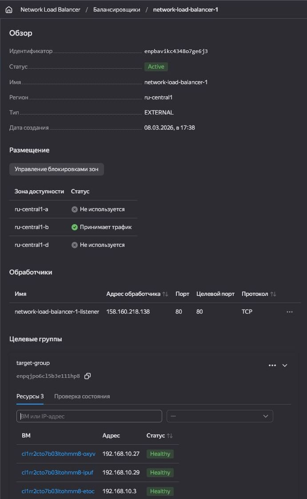
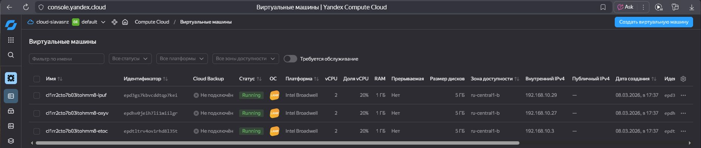
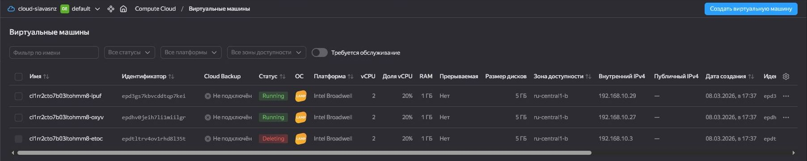
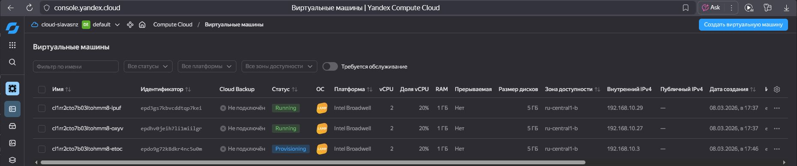

# Домашнее задание к занятию «Вычислительные мощности. Балансировщики нагрузки»  

### Подготовка к выполнению задания

1. Домашнее задание состоит из обязательной части, которую нужно выполнить на провайдере Yandex Cloud, и дополнительной части в AWS (выполняется по желанию). 
2. Все домашние задания в блоке 15 связаны друг с другом и в конце представляют пример законченной инфраструктуры.  
3. Все задания нужно выполнить с помощью Terraform. Результатом выполненного домашнего задания будет код в репозитории. 
4. Перед началом работы настройте доступ к облачным ресурсам из Terraform, используя материалы прошлых лекций и домашних заданий.

---
## Задание 1. Yandex Cloud 

**Что нужно сделать**

1. Создать бакет Object Storage и разместить в нём файл с картинкой:

 - Создать бакет в Object Storage с произвольным именем (например, _имя_студента_дата_).
 - Положить в бакет файл с картинкой.
 - Сделать файл доступным из интернета.
 
2. Создать группу ВМ в public подсети фиксированного размера с шаблоном LAMP и веб-страницей, содержащей ссылку на картинку из бакета:

 - Создать Instance Group с тремя ВМ и шаблоном LAMP. Для LAMP рекомендуется использовать `image_id = fd827b91d99psvq5fjit`.
 - Для создания стартовой веб-страницы рекомендуется использовать раздел `user_data` в [meta_data](https://cloud.yandex.ru/docs/compute/concepts/vm-metadata).
 - Разместить в стартовой веб-странице шаблонной ВМ ссылку на картинку из бакета.
 - Настроить проверку состояния ВМ.
 
3. Подключить группу к сетевому балансировщику:

 - Создать сетевой балансировщик.
 - Проверить работоспособность, удалив одну или несколько ВМ.
4. (дополнительно)* Создать Application Load Balancer с использованием Instance group и проверкой состояния.


### Deployment
```sh

Terraform used the selected providers to generate the following execution plan. Resource actions are indicated with the following symbols:
  + create

Terraform will perform the following actions:

  # local_file.cloud-config will be created
  + resource "local_file" "cloud-config" {
      + content              = <<-EOT
            #cloud-config
            datasource:
              Ec2:
                strict_id: false
            ssh_pwauth: no
            users:
            - name: user
              sudo: 'ALL=(ALL) NOPASSWD:ALL'
              shell: /bin/bash
              ssh_authorized_keys:
              - "ubuntu:ssh-ed25519 AAAAC3NzaC1lZDI1NTE5AAAAIP8Kjh2WHr1Fv1tdSGmYq3G5or9wrueUjO4VgU1xJeO3 slava@DESKTOP
            "
            write_files:
              - path: "/var/www/html/index.html"
                permissions: "755"
                content: |
                  <!DOCTYPE html>
                  <html lang="en">
                  <head>
                      <meta charset="UTF-8">
                      <meta name="viewport" content="width=device-width, initial-scale=1.0">
                      <title>Document</title>
                  </head>
                  <body>
                      <h1>Hello world !!!</h1>
                      
                  </body>
                  </html>

                defer: true
        EOT
      + content_base64sha256 = (known after apply)
      + content_base64sha512 = (known after apply)
      + content_md5          = (known after apply)
      + content_sha1         = (known after apply)
      + content_sha256       = (known after apply)
      + content_sha512       = (known after apply)
      + directory_permission = "0777"
      + file_permission      = "0777"
      + filename             = "cloud-config.yaml"
      + id                   = (known after apply)
    }

  # yandex_compute_instance_group.ig-1 will be created
  + resource "yandex_compute_instance_group" "ig-1" {
      + created_at          = (known after apply)
      + deletion_protection = false
      + folder_id           = "b1g66aah472mb1u75kr7"
      + id                  = (known after apply)
      + instances           = (known after apply)
      + name                = "fixed-ig-with-balancer"
      + service_account_id  = "ajegsep6pi9agjsf67uu"
      + status              = (known after apply)

      + allocation_policy {
          + zones = [
              + "ru-central1-b",
            ]
        }

      + deploy_policy {
          + max_creating     = 0
          + max_deleting     = 0
          + max_expansion    = 0
          + max_unavailable  = 1
          + startup_duration = 0
          + strategy         = (known after apply)
        }

      + instance_template {
          + labels      = (known after apply)
          + metadata    = {
              + "user-data" = <<-EOT
                    #cloud-config
                    datasource:
                      Ec2:
                        strict_id: false
                    ssh_pwauth: no
                    users:
                    - name: user
                      sudo: 'ALL=(ALL) NOPASSWD:ALL'
                      shell: /bin/bash
                      ssh_authorized_keys:
                      - "ubuntu:ssh-ed25519 AAAAC3NzaC1lZDI1NTE5AAAAIP8Kjh2WHr1Fv1tdSGmYq3G5or9wrueUjO4VgU1xJeO3 slava@DESKTOP
                    "
                    write_files:
                      - path: "/var/www/html/index.html"
                        permissions: "755"
                        content: |
                          <!DOCTYPE html>
                          <html lang="en">
                          <head>
                              <meta charset="UTF-8">
                              <meta name="viewport" content="width=device-width, initial-scale=1.0">
                              <title>Document</title>
                          </head>
                          <body>
                              <h1>Hello world !!!</h1>
                              
                          </body>
                          </html>

                        defer: true
                EOT
            }
          + platform_id = "standard-v1"

          + boot_disk {
              + device_name = (known after apply)
              + mode        = "READ_WRITE"

              + initialize_params {
                  + image_id    = "fd827b91d99psvq5fjit"
                  + size        = 5
                  + snapshot_id = (known after apply)
                  + type        = "network-hdd"
                }
            }

          + metadata_options (known after apply)

          + network_interface {
              + ip_address         = (known after apply)
              + ipv4               = true
              + ipv6               = (known after apply)
              + ipv6_address       = (known after apply)
              + nat                = (known after apply)
              + network_id         = (known after apply)
              + security_group_ids = (known after apply)
              + subnet_ids         = (known after apply)
            }

          + resources {
              + core_fraction = 20
              + cores         = 2
              + memory        = 1
            }

          + scheduling_policy (known after apply)
        }

      + load_balancer {
          + status_message           = (known after apply)
          + target_group_description = "Целевая группа Network Load Balancer"
          + target_group_id          = (known after apply)
          + target_group_name        = "target-group"
        }

      + scale_policy {
          + fixed_scale {
              + size = 3
            }
        }
    }

  # yandex_iam_service_account_static_access_key.sa-static-key will be created
  + resource "yandex_iam_service_account_static_access_key" "sa-static-key" {
      + access_key                   = (known after apply)
      + created_at                   = (known after apply)
      + description                  = "static access key for object storage"
      + encrypted_secret_key         = (known after apply)
      + id                           = (known after apply)
      + key_fingerprint              = (known after apply)
      + output_to_lockbox_version_id = (known after apply)
      + secret_key                   = (sensitive value)
      + service_account_id           = "ajegsep6pi9agjsf67uu"
    }

  # yandex_lb_network_load_balancer.lb-1 will be created
  + resource "yandex_lb_network_load_balancer" "lb-1" {
      + allow_zonal_shift   = (known after apply)
      + created_at          = (known after apply)
      + deletion_protection = (known after apply)
      + folder_id           = (known after apply)
      + id                  = (known after apply)
      + name                = "network-load-balancer-1"
      + region_id           = (known after apply)
      + type                = "external"

      + attached_target_group {
          + target_group_id = (known after apply)

          + healthcheck {
              + healthy_threshold   = 2
              + interval            = 2
              + name                = "http"
              + timeout             = 1
              + unhealthy_threshold = 2

              + http_options {
                  + path = "/index.html"
                  + port = 80
                }
            }
        }

      + listener {
          + name        = "network-load-balancer-1-listener"
          + port        = 80
          + protocol    = (known after apply)
          + target_port = (known after apply)

          + external_address_spec {
              + address    = (known after apply)
              + ip_version = "ipv4"
            }
        }
    }

  # yandex_storage_bucket.this will be created
  + resource "yandex_storage_bucket" "this" {
      + acl                   = (known after apply)
      + bucket                = "sbaucket"
      + bucket_domain_name    = (known after apply)
      + default_storage_class = (known after apply)
      + folder_id             = "b1g66aah472mb1u75kr7"
      + force_destroy         = false
      + id                    = (known after apply)
      + policy                = (known after apply)
      + website_domain        = (known after apply)
      + website_endpoint      = (known after apply)

      + anonymous_access_flags {
          + config_read = false
          + list        = true
          + read        = true
        }

      + grant (known after apply)

      + versioning (known after apply)

      + website {
          + index_document = "index.html"
        }
    }

  # yandex_storage_object.s3img will be created
  + resource "yandex_storage_object" "s3img" {
      + access_key   = (known after apply)
      + acl          = "private"
      + bucket       = "sbaucket"
      + content_type = (known after apply)
      + id           = (known after apply)
      + key          = "img.webp"
      + secret_key   = (sensitive value)
      + source       = "html/FDC Willard.webp"
    }

  # yandex_storage_object.s3obj will be created
  + resource "yandex_storage_object" "s3obj" {
      + access_key   = (known after apply)
      + acl          = "private"
      + bucket       = "sbaucket"
      + content_type = (known after apply)
      + id           = (known after apply)
      + key          = "index.html"
      + secret_key   = (sensitive value)
      + source       = "html/index.html"
    }

  # yandex_vpc_network.vpc_net will be created
  + resource "yandex_vpc_network" "vpc_net" {
      + created_at                = (known after apply)
      + default_security_group_id = (known after apply)
      + folder_id                 = (known after apply)
      + id                        = (known after apply)
      + labels                    = (known after apply)
      + name                      = "vpc"
      + subnet_ids                = (known after apply)
    }

  # yandex_vpc_security_group.vpc_sg will be created
  + resource "yandex_vpc_security_group" "vpc_sg" {
      + created_at = (known after apply)
      + folder_id  = "b1g66aah472mb1u75kr7"
      + id         = (known after apply)
      + labels     = (known after apply)
      + name       = "vpc_net-sg"
      + network_id = (known after apply)
      + status     = (known after apply)

      + egress {
          + description       = "разрешить весь исходящий трафик"
          + from_port         = 0
          + id                = (known after apply)
          + labels            = (known after apply)
          + port              = -1
          + protocol          = "ANY"
          + to_port           = 65365
          + v4_cidr_blocks    = [
              + "0.0.0.0/0",
            ]
          + v6_cidr_blocks    = []
            # (2 unchanged attributes hidden)
        }

      + ingress {
          + description       = "разрешить ping"
          + from_port         = -1
          + id                = (known after apply)
          + labels            = (known after apply)
          + port              = -1
          + protocol          = "ICMP"
          + to_port           = -1
          + v4_cidr_blocks    = [
              + "0.0.0.0/0",
            ]
          + v6_cidr_blocks    = []
            # (2 unchanged attributes hidden)
        }
      + ingress {
          + description       = "разрешить входящий  http"
          + from_port         = -1
          + id                = (known after apply)
          + labels            = (known after apply)
          + port              = 80
          + protocol          = "TCP"
          + to_port           = -1
          + v4_cidr_blocks    = [
              + "0.0.0.0/0",
            ]
          + v6_cidr_blocks    = []
            # (2 unchanged attributes hidden)
        }
      + ingress {
          + description       = "разрешить входящий https"
          + from_port         = -1
          + id                = (known after apply)
          + labels            = (known after apply)
          + port              = 443
          + protocol          = "TCP"
          + to_port           = -1
          + v4_cidr_blocks    = [
              + "0.0.0.0/0",
            ]
          + v6_cidr_blocks    = []
            # (2 unchanged attributes hidden)
        }
      + ingress {
          + description       = "разрешить входящий ssh"
          + from_port         = -1
          + id                = (known after apply)
          + labels            = (known after apply)
          + port              = 22
          + protocol          = "TCP"
          + to_port           = -1
          + v4_cidr_blocks    = [
              + "0.0.0.0/0",
            ]
          + v6_cidr_blocks    = []
            # (2 unchanged attributes hidden)
        }
    }

  # yandex_vpc_subnet.vpc_public_subnet will be created
  + resource "yandex_vpc_subnet" "vpc_public_subnet" {
      + created_at     = (known after apply)
      + folder_id      = (known after apply)
      + id             = (known after apply)
      + labels         = (known after apply)
      + name           = "public"
      + network_id     = (known after apply)
      + v4_cidr_blocks = [
          + "192.168.10.0/24",
        ]
      + v6_cidr_blocks = (known after apply)
      + zone           = "ru-central1-b"
    }

Plan: 10 to add, 0 to change, 0 to destroy.

Changes to Outputs:
  + vpcs = (known after apply)
  + www  = "http(s)://website.yandexcloud.net/sbaucket/img.webp"
yandex_vpc_network.vpc_net: Creating...
yandex_iam_service_account_static_access_key.sa-static-key: Creating...
yandex_storage_bucket.this: Creating...
yandex_iam_service_account_static_access_key.sa-static-key: Creation complete after 1s [id=ajeu1cplltpuhipkcukp]
yandex_vpc_network.vpc_net: Creation complete after 2s [id=enph9k9aki57edpicih8]
yandex_vpc_subnet.vpc_public_subnet: Creating...
yandex_vpc_security_group.vpc_sg: Creating...
yandex_vpc_subnet.vpc_public_subnet: Creation complete after 1s [id=e2lfjg1fk47qipmjcuqn]
yandex_vpc_security_group.vpc_sg: Creation complete after 2s [id=enp92ba4jmv3tvk668fp]
yandex_storage_bucket.this: Still creating... [00m10s elapsed]
yandex_storage_bucket.this: Creation complete after 15s [id=sbaucket]
yandex_storage_object.s3img: Creating...
yandex_storage_object.s3img: Creation complete after 1s [id=img.webp]
yandex_storage_object.s3obj: Creating...
local_file.cloud-config: Creating...
local_file.cloud-config: Creation complete after 0s [id=9d7027f276777d25650060b968d364c6e53a0b59]
yandex_compute_instance_group.ig-1: Creating...
yandex_storage_object.s3obj: Creation complete after 0s [id=index.html]
yandex_compute_instance_group.ig-1: Still creating... [00m12s elapsed]
yandex_compute_instance_group.ig-1: Still creating... [00m22s elapsed]
yandex_compute_instance_group.ig-1: Still creating... [00m32s elapsed]
yandex_compute_instance_group.ig-1: Still creating... [00m44s elapsed]
yandex_compute_instance_group.ig-1: Still creating... [00m54s elapsed]
yandex_compute_instance_group.ig-1: Creation complete after 1m4s [id=cl1rr2cto7b03ltohmm8]
yandex_lb_network_load_balancer.lb-1: Creating...
yandex_lb_network_load_balancer.lb-1: Creation complete after 2s [id=enpbavikc4348o7ge6j3]

Apply complete! Resources: 10 added, 0 changed, 0 destroyed.

Outputs:

vpcs = {}
www = "http(s)://website.yandexcloud.net/sbaucket/img.webp"

```

### Балансировщик


### Виртуальные машины


### Проверка



Полезные документы:

- [Создание бакета (в yandex cloud)](https://yandex.cloud/ru/docs/storage/operations/buckets/create#tf_1)
- [Работа с группой виртуальных машин с автоматическим масштабированием с помощью Terraform](https://yandex.cloud/ru/docs/compute/tutorials/vm-autoscale/terraform).
- [Создать автоматически масштабируемую группу виртуальных машин](https://yandex.cloud/ru/docs/compute/operations/instance-groups/create-autoscaled-group)
- [Создать группу виртуальных машин фиксированного размера с L7-балансировщиком](https://yandex.cloud/ru/docs/compute/operations/instance-groups/create-with-load-balancer)
- [Создать группу виртуальных машин фиксированного размера с сетевым балансировщиком нагрузки](https://yandex.cloud/ru/docs/compute/operations/instance-groups/create-with-balancer)
- [Сайт на LAMP- или LEMP-стеке с помощью Terraform](https://yandex.cloud/ru/docs/tutorials/web/lamp-lemp/terraform?utm_referrer=about%3Ablank)

- [Object Storage (S3) Terraform module for Yandex.Cloud](https://github.com/terraform-yc-modules/terraform-yc-s3/tree/master)


- [Network Load Balancer](https://registry.terraform.io/providers/yandex-cloud/yandex/latest/docs/resources/lb_network_load_balancer).
- [Группа ВМ с сетевым балансировщиком](https://cloud.yandex.ru/docs/compute/operations/instance-groups/create-with-balancer).

---
## Задание 2*. AWS (задание со звёздочкой)

Это необязательное задание. Его выполнение не влияет на получение зачёта по домашней работе.

**Что нужно сделать**

Используя конфигурации, выполненные в домашнем задании из предыдущего занятия, добавить к Production like сети Autoscaling group из трёх EC2-инстансов с  автоматической установкой веб-сервера в private домен.

1. Создать бакет S3 и разместить в нём файл с картинкой:

 - Создать бакет в S3 с произвольным именем (например, _имя_студента_дата_).
 - Положить в бакет файл с картинкой.
 - Сделать доступным из интернета.
2. Сделать Launch configurations с использованием bootstrap-скрипта с созданием веб-страницы, на которой будет ссылка на картинку в S3. 
3. Загрузить три ЕС2-инстанса и настроить LB с помощью Autoscaling Group.

Resource Terraform:

- [S3 bucket](https://registry.terraform.io/providers/hashicorp/aws/latest/docs/resources/s3_bucket)
- [Launch Template](https://registry.terraform.io/providers/hashicorp/aws/latest/docs/resources/launch_template).
- [Autoscaling group](https://registry.terraform.io/providers/hashicorp/aws/latest/docs/resources/autoscaling_group).
- [Launch configuration](https://registry.terraform.io/providers/hashicorp/aws/latest/docs/resources/launch_configuration).

Пример bootstrap-скрипта:

```
#!/bin/bash
yum install httpd -y
service httpd start
chkconfig httpd on
cd /var/www/html
echo "<html><h1>My cool web-server</h1></html>" > index.html
```
### Правила приёма работы

Домашняя работа оформляется в своём Git репозитории в файле README.md. Выполненное домашнее задание пришлите ссылкой на .md-файл в вашем репозитории.
Файл README.md должен содержать скриншоты вывода необходимых команд, а также скриншоты результатов.
Репозиторий должен содержать тексты манифестов или ссылки на них в файле README.md.
