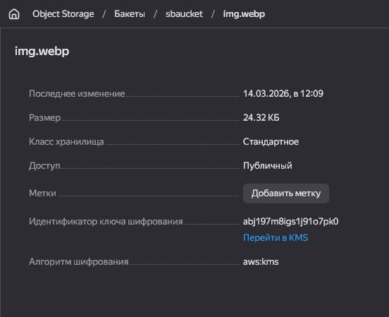

# Домашнее задание к занятию «Безопасность в облачных провайдерах»  

Используя конфигурации, выполненные в рамках предыдущих домашних заданий, нужно добавить возможность шифрования бакета.

---
## Задание 1. Yandex Cloud   

1. С помощью ключа в KMS необходимо зашифровать содержимое бакета:

 - создать ключ в KMS;
 - с помощью ключа зашифровать содержимое бакета, созданного ранее.


```sh
slava@DESKTOP:~/netology.git/cloudprov-homeworks/15.3/src$ terraform apply --auto-approve

Terraform used the selected providers to generate the following execution plan. Resource actions are indicated with the following symbols:
  + create

Terraform will perform the following actions:

  # yandex_iam_service_account_static_access_key.sa-static-key will be created
  + resource "yandex_iam_service_account_static_access_key" "sa-static-key" {
      + access_key                   = (known after apply)
      + created_at                   = (known after apply)
      + description                  = "static access key for object storage"
      + encrypted_secret_key         = (known after apply)
      + id                           = (known after apply)
      + key_fingerprint              = (known after apply)
      + output_to_lockbox_version_id = (known after apply)
      + secret_key                   = (sensitive value)
      + service_account_id           = "ajegsep6pi9agjsf67uu"
    }

  # yandex_kms_symmetric_key.key-a will be created
  + resource "yandex_kms_symmetric_key" "key-a" {
      + created_at          = (known after apply)
      + default_algorithm   = "AES_128"
      + deletion_protection = false
      + description         = "Key for bucket"
      + folder_id           = (known after apply)
      + id                  = (known after apply)
      + labels              = (known after apply)
      + name                = "kms-128"
      + rotated_at          = (known after apply)
      + rotation_period     = "8760h"
      + status              = (known after apply)
      + symmetric_key_id    = (known after apply)
    }

  # yandex_storage_bucket.this will be created
  + resource "yandex_storage_bucket" "this" {
      + acl                   = (known after apply)
      + bucket                = "sbaucket"
      + bucket_domain_name    = (known after apply)
      + default_storage_class = (known after apply)
      + folder_id             = "b1g66aah472mb1u75kr7"
      + force_destroy         = false
      + id                    = (known after apply)
      + policy                = (known after apply)
      + website_domain        = (known after apply)
      + website_endpoint      = (known after apply)

      + anonymous_access_flags {
          + config_read = false
          + list        = true
          + read        = true
        }

      + grant (known after apply)

      + server_side_encryption_configuration {
          + rule {
              + apply_server_side_encryption_by_default {
                  + kms_master_key_id = (known after apply)
                  + sse_algorithm     = "aws:kms"
                }
            }
        }

      + versioning (known after apply)

      + website {
          + index_document = "index.html"
        }
    }

  # yandex_storage_object.s3img will be created
  + resource "yandex_storage_object" "s3img" {
      + access_key   = (known after apply)
      + acl          = "private"
      + bucket       = "sbaucket"
      + content_type = (known after apply)
      + id           = (known after apply)
      + key          = "img.webp"
      + secret_key   = (sensitive value)
      + source       = "html/FDC Willard.webp"
    }

  # yandex_storage_object.s3obj will be created
  + resource "yandex_storage_object" "s3obj" {
      + access_key   = (known after apply)
      + acl          = "private"
      + bucket       = "sbaucket"
      + content_type = (known after apply)
      + id           = (known after apply)
      + key          = "index.html"
      + secret_key   = (sensitive value)
      + source       = "html/index.html"
    }

  # yandex_vpc_network.vpc_net will be created
  + resource "yandex_vpc_network" "vpc_net" {
      + created_at                = (known after apply)
      + default_security_group_id = (known after apply)
      + folder_id                 = (known after apply)
      + id                        = (known after apply)
      + labels                    = (known after apply)
      + name                      = "vpc"
      + subnet_ids                = (known after apply)
    }

  # yandex_vpc_security_group.vpc_sg will be created
  + resource "yandex_vpc_security_group" "vpc_sg" {
      + created_at = (known after apply)
      + folder_id  = "b1g66aah472mb1u75kr7"
      + id         = (known after apply)
      + labels     = (known after apply)
      + name       = "vpc_net-sg"
      + network_id = (known after apply)
      + status     = (known after apply)

      + egress {
          + description       = "разрешить весь исходящий трафик"
          + from_port         = 0
          + id                = (known after apply)
          + labels            = (known after apply)
          + port              = -1
          + protocol          = "ANY"
          + to_port           = 65365
          + v4_cidr_blocks    = [
              + "0.0.0.0/0",
            ]
          + v6_cidr_blocks    = []
            # (2 unchanged attributes hidden)
        }

      + ingress {
          + description       = "разрешить ping"
          + from_port         = -1
          + id                = (known after apply)
          + labels            = (known after apply)
          + port              = -1
          + protocol          = "ICMP"
          + to_port           = -1
          + v4_cidr_blocks    = [
              + "0.0.0.0/0",
            ]
          + v6_cidr_blocks    = []
            # (2 unchanged attributes hidden)
        }
      + ingress {
          + description       = "разрешить входящий  http"
          + from_port         = -1
          + id                = (known after apply)
          + labels            = (known after apply)
          + port              = 80
          + protocol          = "TCP"
          + to_port           = -1
          + v4_cidr_blocks    = [
              + "0.0.0.0/0",
            ]
          + v6_cidr_blocks    = []
            # (2 unchanged attributes hidden)
        }
      + ingress {
          + description       = "разрешить входящий https"
          + from_port         = -1
          + id                = (known after apply)
          + labels            = (known after apply)
          + port              = 443
          + protocol          = "TCP"
          + to_port           = -1
          + v4_cidr_blocks    = [
              + "0.0.0.0/0",
            ]
          + v6_cidr_blocks    = []
            # (2 unchanged attributes hidden)
        }
      + ingress {
          + description       = "разрешить входящий ssh"
          + from_port         = -1
          + id                = (known after apply)
          + labels            = (known after apply)
          + port              = 22
          + protocol          = "TCP"
          + to_port           = -1
          + v4_cidr_blocks    = [
              + "0.0.0.0/0",
            ]
          + v6_cidr_blocks    = []
            # (2 unchanged attributes hidden)
        }
    }

  # yandex_vpc_subnet.vpc_public_subnet will be created
  + resource "yandex_vpc_subnet" "vpc_public_subnet" {
      + created_at     = (known after apply)
      + folder_id      = (known after apply)
      + id             = (known after apply)
      + labels         = (known after apply)
      + name           = "public"
      + network_id     = (known after apply)
      + v4_cidr_blocks = [
          + "192.168.10.0/24",
        ]
      + v6_cidr_blocks = (known after apply)
      + zone           = "ru-central1-a"
    }

Plan: 8 to add, 0 to change, 0 to destroy.

Changes to Outputs:
  + vpcs = (known after apply)
  + www  = "http(s)://website.yandexcloud.net/sbaucket/img.webp"
yandex_iam_service_account_static_access_key.sa-static-key: Creating...
yandex_vpc_network.vpc_net: Creating...
yandex_kms_symmetric_key.key-a: Creating...
yandex_kms_symmetric_key.key-a: Creation complete after 2s [id=abj197m8igs1j91o7pk0]
yandex_storage_bucket.this: Creating...
yandex_iam_service_account_static_access_key.sa-static-key: Creation complete after 2s [id=aje024vrc0j1m5kfg4r2]
yandex_vpc_network.vpc_net: Creation complete after 3s [id=enpl2pdlevskep9ue18u]
yandex_vpc_subnet.vpc_public_subnet: Creating...
yandex_vpc_security_group.vpc_sg: Creating...
yandex_vpc_subnet.vpc_public_subnet: Creation complete after 0s [id=e9bcs98tb9nv21v4bf5s]
yandex_vpc_security_group.vpc_sg: Creation complete after 2s [id=enpj9cnvvptknckk64oe]
yandex_storage_bucket.this: Still creating... [00m10s elapsed]
yandex_storage_bucket.this: Creation complete after 15s [id=sbaucket]
yandex_storage_object.s3img: Creating...
yandex_storage_object.s3img: Creation complete after 1s [id=img.webp]
yandex_storage_object.s3obj: Creating...
yandex_storage_object.s3obj: Creation complete after 0s [id=index.html]

Apply complete! Resources: 8 added, 0 changed, 0 destroyed.

Outputs:

vpcs = {}
www = "http(s)://website.yandexcloud.net/sbaucket/img.webp"
```



2. (Выполняется не в Terraform)* Создать статический сайт в Object Storage c собственным публичным адресом и сделать доступным по HTTPS:

 - создать сертификат;
 - создать статическую страницу в Object Storage и применить сертификат HTTPS;
 - в качестве результата предоставить скриншот на страницу с сертификатом в заголовке (замочек).

Полезные документы:

- [Настройка HTTPS статичного сайта](https://cloud.yandex.ru/docs/storage/operations/hosting/certificate).
- [Object Storage bucket](https://registry.terraform.io/providers/yandex-cloud/yandex/latest/docs/resources/storage_bucket).
- [KMS key](https://registry.terraform.io/providers/yandex-cloud/yandex/latest/docs/resources/kms_symmetric_key).

--- 
## Задание 2*. AWS (задание со звёздочкой)

Это необязательное задание. Его выполнение не влияет на получение зачёта по домашней работе.

**Что нужно сделать**

1. С помощью роли IAM записать файлы ЕС2 в S3-бакет:
 - создать роль в IAM для возможности записи в S3 бакет;
 - применить роль к ЕС2-инстансу;
 - с помощью bootstrap-скрипта записать в бакет файл веб-страницы.
2. Организация шифрования содержимого S3-бакета:

 - используя конфигурации, выполненные в домашнем задании из предыдущего занятия, добавить к созданному ранее бакету S3 возможность шифрования Server-Side, используя общий ключ;
 - включить шифрование SSE-S3 бакету S3 для шифрования всех вновь добавляемых объектов в этот бакет.

3. *Создание сертификата SSL и применение его к ALB:

 - создать сертификат с подтверждением по email;
 - сделать запись в Route53 на собственный поддомен, указав адрес LB;
 - применить к HTTPS-запросам на LB созданный ранее сертификат.

Resource Terraform:

- [IAM Role](https://registry.terraform.io/providers/hashicorp/aws/latest/docs/resources/iam_role).
- [AWS KMS](https://registry.terraform.io/providers/hashicorp/aws/latest/docs/resources/kms_key).
- [S3 encrypt with KMS key](https://registry.terraform.io/providers/hashicorp/aws/latest/docs/resources/s3_bucket_object#encrypting-with-kms-key).

Пример bootstrap-скрипта:

```
#!/bin/bash
yum install httpd -y
service httpd start
chkconfig httpd on
cd /var/www/html
echo "<html><h1>My cool web-server</h1></html>" > index.html
aws s3 mb s3://mysuperbacketname2021
aws s3 cp index.html s3://mysuperbacketname2021
```

### Правила приёма работы

Домашняя работа оформляется в своём Git репозитории в файле README.md. Выполненное домашнее задание пришлите ссылкой на .md-файл в вашем репозитории.
Файл README.md должен содержать скриншоты вывода необходимых команд, а также скриншоты результатов.
Репозиторий должен содержать тексты манифестов или ссылки на них в файле README.md.
